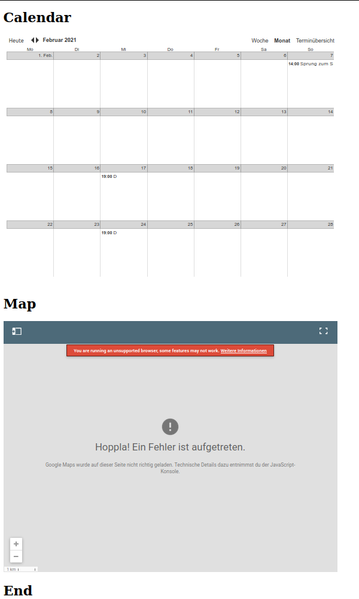

# change-google-iframe-css-via-php

## Motivation and goal

Embedded Google calendars and maps in iframes are powerful but not usually elegant. Using a simple php script and some css this can be changed.

This repository offers a small proof-of-principle towards a simple calendar design and a slightly reduced map.

To develop these changes, instructions for setting up a local Apache webserver under Linux (L)Ubuntu are provided for convenience.

## Install and run local webserver for testing

Install Apache under Linux (L)Ubuntu:

sudo apt-get install apache2 php libapache2-mod-php

sudo service apache2 status

sudo service apache2 start

Copy repository files to webserver:

/var/www/html/

Run html page embedding both calendar and map:

http://localhost/iframe.html

## Disclaimer

Please use modifications only if allowed by Google terms of use.

The css file is not-well written, please feel free to improve!

## Credits

Parts of this repository are based on the following [answer](https://stackoverflow.com/a/12521755/5350621), [article](https://codersgrave.com/integrating-styled-google-calendar-website/), and [snippet](https://css-tricks.com/snippets/css/css-triangle/).

